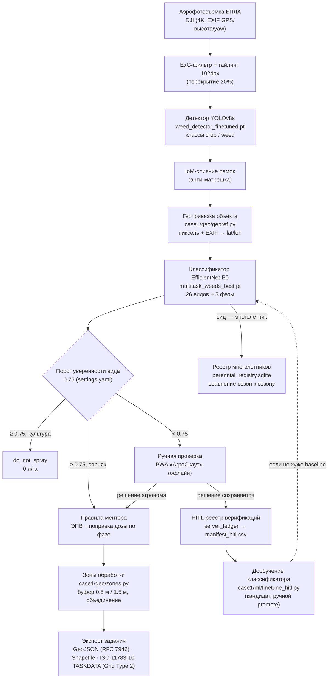

# AgroVision AI — мониторинг сорняков и карта дифференцированного опрыскивания

Проект команды TEAM1 для Кейса №1 Qostanai AgroTech Hackathon 2026 (партнёр кейса — агрохолдинг «Олжа Агро», Костанайская область). Команда заняла первое место; этот репозиторий — доработка после хакатона по просьбе жюри: привести документацию и код в порядок и опубликовать честную версию проекта.

## Что это и для кого

AgroVision AI превращает аэрофотосъёмку поля дроном в карту точечного внесения гербицида. Снимок проходит через детектор сорняков и культуры, каждая находка вырезается и классифицируется по виду (26 видов из справочника кейса) и фазе развития, а дальше применяются агрономические правила ментора (пороги ЭПВ, поправка дозы по фазе, защита пшеницы). Там, где модель не уверена, объект уходит агроному в офлайн-приложение, а не под опрыскиватель. Итог — координаты очагов, зоны обработки и файл задания для терминала опрыскивателя.

Адресат — агроном и агроинженер хозяйства, которым нужен обзор поля перед выездом, и полевой агроном, который подтверждает сомнительные случаи прямо в поле без связи. Второй адресат — жюри и будущие разработчики: репозиторий должен быть проверяемым, а не презентационным.

Это MVP уровня **post-flight decision support**, не автономное реал-тайм опрыскивание и не сертифицированный агрономический продукт. Модели дообучаемы, а не статичны: каждое решение агронома может пойти на дообучение классификатора (раздел [Human-in-the-Loop](#human-in-the-loop-и-дообучение-на-решениях-агронома)).

## Статус проекта коротко

| Утверждение из старой версии README | Что показывает проверка | Файл-источник |
|---|---|---|
| «Test mAP@50 77.1%» | На независимом тесте (381 изображение) mAP50 = **0.7715**; на 313 «чистых» реальных изображениях без синтетики — **0.7571** | `case1/output/server_2026-09-17/eval/detector_test_metrics.json`, `detector_test_real_only_metrics.json` |
| «26 видов + пшеница, 3 фазы» (классификатор) | Теперь верно: `species_mapping.json` — 26 классов вида + 3 фазы; тест на 1591 эталонных фото: accuracy 98.4% / F1 98.4% (вид), 98.7% (фаза) | `case1/models/species_mapping.json`, `case1/output/classifier_training_metrics.json` |
| «p50 = 6.8 мс» как аудированная задержка полного конвейера | Это реальный, но частный замер: только классификация одной вырезки на GPU-сервере (CUDA), 40 итераций. На локальном Apple Silicon (MPS, 15 итераций) тот же тест даёт p50 = 16.07 мс. Обе цифры реальны, но это не задержка всего конвейера — см. раздел [Скорость](#скорость) | `case1/output/server_2026-09-17/latency_benchmark_report.json`, `case1/output/latency_benchmark_report.json` |
| «2 926 кадров / 10 671 бокс» | Не подтверждается: локальный датасет детектора (`yolo_combined`) — 2 506 кадров / 9 971 бокс | `case1/data/dataset_catalog.json`, `ls case1/data/yolo_combined/labels/*` |
| «+1 450 ₸/га» и «15 млн ₸ на 1000 га» одновременно | Внутреннее противоречие (15 000 000 / 1000 = 15 000 ₸/га, не 1 450). Экономика ниже дана как формула и сценарный расчёт, а не как факт | см. [Экономика](#экономика-формула-и-сценарный-расчёт) |
| «0% повреждения пшеницы» | Пшеница не является отдельным классом классификатора: культура отделяется детектором (классы `crop`/`weed`). Реального теста «доля ложных опрысков пшеницы» в репозитории нет | `case1/ml/multitask_model.py`, `case1/output/server_2026-09-17/eval/` |
| «Напрямую в John Deere CommandCenter / Amazone» | Экспорт — валидный ISO 11783-10 Grid Type 2 XML, но не проверен ни на одном реальном терминале и не прошёл официальную XSD-валидацию AEF | `case1/geo/isoxml.py`, `docs/antigravity_task_geo.md` |

Полный список расхождений и как они были найдены — в `docs/overall-metrics-audit-2026-09-18.md`, `docs/architecture-agronomy-audit-2026-09-18.md` и `docs/server-eval-2026-09-18.md`. Данный README построен на верифицированных в этих аудитах цифрах и на прогонах после них.

## Архитектура сквозного конвейера



Каждый узел — реально существующий модуль, а не план: `case1/ml/multitask_model.py`, `case1/geo/georef.py`, `case1/geo/zones.py`, `case1/geo/isoxml.py`, `case1/ml/hitl_export.py`, `case1/ml/finetune_hitl.py`, `case1/data/perennial_registry.py`, `case1/mobile/`. Порог 0.75 задаётся один раз в `case1/configs/settings.yaml` (`review.species_confidence_threshold`) и читается через `case1.configs.loader.get_species_confidence_threshold()` — раньше он был продублирован (0.60 и 0.65) в разных модулях, сейчас источник один.

## Метрики

Каждое число ниже — из файла в репозитории; путь указан в последней колонке. Где сравнение возможно, дано «лабораторные условия vs реальные кадры дрона», потому что это разные вещи и путать их нечестно.

### Детектор (YOLOv8s, классы `crop` / `weed`)

| Показатель | Значение | Выборка | Источник |
|---|---:|---|---|
| mAP@50 | **0.7715** | Полный независимый тест, 381 изображение (313 реальных + 56 синтетических copy-paste + 12 пустых негативов) | `case1/output/server_2026-09-17/eval/detector_test_metrics.json` |
| mAP@50-95 | 0.4858 | Тот же тест | там же |
| mAP@50 (только реальные снимки) | **0.7571** | 313 реальных изображений, без синтетики | `case1/output/server_2026-09-17/eval/detector_test_real_only_metrics.json` |
| mAP@50 по классам | crop 0.782 / weed 0.761 | Полный тест | `detector_test_metrics.json` |
| Ложные срабатывания на чистой почве | 1 бокс на 12 пустых тайлов (8.3% изображений) | 12 негативных изображений, conf ≥ 0.25 | `case1/output/server_2026-09-17/eval/negatives_fp_report.json` |
| mAP@50 (валидация при обучении) | 0.804 | Val split обучающего датасета | `case1/output/server_2026-09-17/results.csv` (эпоха 25), см. `MANIFEST.md` в той же папке |

### Классификатор (EfficientNet-B0, multi-task, Focal Loss)

| Показатель | Лабораторные эталонные фото | Реальные кадры дрона |
|---|---:|---:|
| Species accuracy / macro-F1 | **98.4% / 98.4%** (1591 тестовых кроп из `Dataset 1 кейс`) | медианная уверенность вида **0.49** |
| Stage accuracy / macro-F1 | 98.7% / 98.5% | медианная уверенность — не измерялась отдельно |
| Доля объектов с уверенностью < 0.65 | — | **67.8%** (порог теста 0.60 на момент прогона) |
| Доля, ушедшая на ручную проверку | — | **63.85%** (454 из 711 детекций на 40 кадрах) |

Источники: `case1/output/classifier_training_metrics.json` (26 классов вида, `case1/models/species_mapping.json`, датасет train/val/test = 7132/1503/1591), `case1/output/server_2026-09-17/field_eval/field_eval_summary.json` (40 реальных кадров, 4 поля, 711 детекций).

Важная оговорка: полевой прогон делался с порогом ручной проверки 0.60. Сейчас единый порог — 0.75 (`case1/configs/settings.yaml`), то есть в проде на ручную проверку сейчас уходит не меньше объектов, чем показано выше, а скорее больше. Это ожидаемый разрыв между студийными фото крупным планом и мелкими вырезками с дрона (domain shift), а не брак модели — поэтому в конвейере и есть шаг ручной проверки.

### Скорость

| Что измерено | Значение | Железо | Источник |
|---|---:|---|---|
| Полный пайплайн на кадр (детектор + классификация всех боксов) | среднее **0.53 с**, медиана 0.51 с, диапазон 0.36–1.23 с | GPU-сервер, H100 MIG 1g.20gb, 40 реальных кадров | `case1/output/server_2026-09-17/field_eval/field_eval_summary.json` |
| Классификация одной вырезки, p50 / p95 | 16.07 мс / 19.81 мс | Apple Silicon, MPS, 15 итераций | `case1/output/latency_benchmark_report.json` |
| Классификация одной вырезки, p50 / p95 | 6.8 мс / 67.99 мс | GPU-сервер, CUDA H100 MIG, 40 итераций | `case1/output/server_2026-09-17/latency_benchmark_report.json` |
| Инференс полного 4K-кадра (тайлинг + детектор) | 5.9–7.0 с/кадр | CPU/MPS, локально | `case1/output/all_fields_report.json` |

Обе цифры «на одну вырезку» реальны, но это не задержка целого конвейера — это время одной классификации на разном железе. Смещение форсунки при такой задержке ничтожно (доли–единицы см), но время полного кадра (секунды) делает инлайн-опрыскивание с камеры на штанге неприменимым — поэтому рабочий режим системы: **предварительный облёт, построение карты, затем обработка** (post-flight advisory), а не опрыскивание в реальном времени по видео с дрона.

Файл `case1/output/e2e_simulation/simulation_report.json` — синтетическая симуляция (`provenance: SYNTHETIC_SIMULATION_NOT_MODEL_VALIDATION`), не источник метрик модели; используется только для проверки формата GeoJSON/ISO-XML.

### Экономика: формула и сценарный расчёт

В репозитории нет измеренного экономического эффекта на реальном поле — только формула и сценарный пример с явными допущениями.

```
Экономия, ₸ = Площадь_поля_га × (1 − Доля_площади_под_обработкой) × Стоимость_гербицидной_смеси_₸/га
```

Пример (иллюстрация, не измерение): поле 1000 га, стоимость сплошной обработки 18 200 ₸/га, реальная площадь очагов + буфер — допустим 17.6% площади → экономия ≈ 1000 × 0.824 × 18 200 ≈ 15.0 млн ₸ на 1000 га. Доля площади под обработкой (17.6%, или любая другая) — параметр сценария, а не измеренное на поле «Олжа Агро» число; фактическая доля зависит от реальной засорённости конкретного поля.

Единственный измеренный прогон — 5 реальных кадров DJI через полный пайплайн `prescribe`: 3 зоны обработки, суммарная площадь 21.18 м², объём раствора 0.53 л (`case1/output/prescription_v2/summary.json`). Это площадь кадров, а не поля — экстраполировать на гектары без данных о площади самого поля нельзя.

## Что уже работает, что прототип, а что концепция

| Компонент | Статус | Основание |
|---|---|---|
| Детектор YOLOv8s (crop/weed) | Работает | Независимый тест, метрики выше |
| Классификатор 26 видов / 3 фазы | Работает, с оговоркой на domain shift | `species_mapping.json`, полевой прогон |
| Правила ментора (ЭПВ, поправка дозы, защита культуры) | Работает | `case1/fleet/agronomy_rules.py`, 5+ тестов |
| Геопривязка отдельного сорняка (не кадра) | Работает | `case1/geo/georef.py`, `case1/tests/test_georef.py` |
| Зоны обработки вокруг очагов | Работает | `case1/geo/zones.py`, `case1/tests/test_zones.py` |
| Экспорт GeoJSON / Shapefile | Работает | `case1/output/prescription_v2/` |
| Экспорт ISO 11783-10 TASKDATA (Grid Type 2) | Работает как формат, **не проверен на реальном терминале** | `case1/geo/isoxml.py`; нет XSD-валидации AEF, нет acceptance-теста на John Deere/Amazone |
| FastAPI-сервер, PWA «АгроСкаут» офлайн | Работает | `case1/server/app.py`, `case1/mobile/` |
| HITL: экспорт решений агронома → дообучение | Работает как пайплайн, кандидат не подменяет модель автоматически | `case1/ml/hitl_export.py`, `case1/ml/finetune_hitl.py` |
| Реестр многолетников «сезон к сезону» | Работает на 1 реальном сезоне; второй сезон в демо — синтетический (`seed_demo_season`, явно помечен в коде) | `case1/data/perennial_registry.py` |
| Docker / docker-compose / HTTPS-скрипт | Написано, статически проверено | Живьём `docker compose up` в этой сборке не запускался — см. `docs/RUN.md`, раздел 2 |
| Планировщик флота 1–5 БПЛА | Работает как расчёт геометрии | `case1/fleet/`, не проверено реальным групповым полётом |
| Док-станция на машине, зарядка, Starlink | Концепция | Не реализовано и не тестировалось в этом репозитории |
| Совместимость с терминалами опрыскивателей | Не проверена | Формат валиден структурно, приёмочного теста на технике нет |

## Быстрый старт

Полная инструкция «с нуля» (Python, Git LFS, Docker, HTTPS для PWA на телефоне, частые ошибки) — в [`docs/RUN.md`](docs/RUN.md). Коротко:

```bash
git lfs install && git lfs pull   # веса моделей хранятся через LFS
make setup                        # venv + зависимости
make test                         # pytest case1/tests
make demo                         # FastAPI (:8000) + Streamlit (:8501)
```

Другие цели: `make server`, `make dashboard`, `make https` (HTTPS-туннель для теста офлайн-PWA на Android), `make verify` (адверсариальная проверка GeoJSON/ISO-XML), `make docker-build` / `make docker-up`. Полный список — `Makefile`.

Тесты в этом прогоне (из корня репозитория, все LFS-артефакты и локальные датасеты на месте):

```bash
.venv/bin/python -m pytest case1/tests -q
# 125 passed, 3 skipped
```

Число пройденных тестов зависит от того, что подтянуто локально (веса из LFS, собранные YOLO-датасеты) — на свежем клоне без полного набора данных часть тестов осознанно пропускается (`skip`), см. `docs/RUN.md`, раздел 5.

## Структура репозитория

```text
.
├── README.md                     # этот файл
├── case1_main.py                 # CLI: status, process, prescribe, train-*, hitl-export, fleet-plan, dashboard, test...
├── Makefile, Dockerfile, docker-compose.yml
├── docs/
│   ├── RUN.md                    # инструкция по запуску с нуля
│   ├── MODEL_CARD.md             # карточки детектора и классификатора
│   ├── CHANGELOG_POST_HACKATHON.md
│   ├── antigravity_task_geo.md   # ТЗ и отчёт по геопривязке/зонам/ISO-XML
│   ├── pitch_3min_hackathon.md   # питч жюри с таблицей источников цифр
│   └── *audit*.md, *server-eval*.md  # независимые проверки метрик
├── case1/
│   ├── server/app.py             # FastAPI: классификация, review-queue, sync, HITL, реестр многолетников
│   ├── dashboard/app.py          # Streamlit, 11 вкладок
│   ├── mobile/                   # офлайн PWA «АгроСкаут» (IndexedDB, Service Worker)
│   ├── ml/                       # модели, обучение, hitl_export.py, finetune_hitl.py, latency_benchmark.py
│   ├── geo/                      # georef.py, zones.py, isoxml.py — геопривязка → зоны → ISO-XML/Shapefile
│   ├── fleet/                    # планировщик БПЛА, agronomy_rules.py
│   ├── data/                     # загрузчики датасетов, perennial_registry.py
│   ├── configs/                  # settings.yaml (единый порог 0.75), agronomy_rules.json
│   ├── models/                   # веса (через Git LFS)
│   ├── output/                   # артефакты прогонов, метрики, eval-отчёты
│   └── tests/                    # pytest-набор
└── scripts/                      # e2e_pipeline_simulation.py, verify_prescription_and_taskdata.py, serve_https.sh
```

## Human-in-the-Loop и дообучение на решениях агронома

Объекты с уверенностью вида ниже 0.75 идут в PWA «АгроСкаут» (работает офлайн, IndexedDB + Service Worker). Решение агронома сохраняется на сервере (`server_ledger` → `POST /api/v1/verify-item` / `/api/v1/sync`). `case1/ml/hitl_export.py` превращает подтверждённые решения в manifest (`case1/data/manifest_hitl.csv`), а `case1/ml/finetune_hitl.py` дообучает копию текущего классификатора на исходном датасете + новых примерах. Дообученная версия **всегда** сохраняется отдельным файлом (`case1/models/hitl/...`) и сравнивается с текущей моделью на отложенной выборке; замена рабочего чекпойнта происходит только вручную и только если кандидат не хуже baseline (`decide_promotion` в `finetune_hitl.py`). Автоматической подмены модели нет. Статистика доступна через `GET /api/v1/hitl/stats` и `python case1_main.py hitl-export`.

## Реестр многолетников

Многолетние сорняки (бодяк, вьюнок, пырей и другие из `PERENNIAL_SPECIES_CODES`) сохраняются в `case1/output/perennial_registry.sqlite` по полю и сезону, чтобы сравнивать очаги от облёта к облёту (`GET /api/v1/perennials`, `GET /api/v1/perennials/compare`, вкладка дашборда «Многолетники по сезонам»). В демо-данных один сезон — реальный прогон, второй сезон для сравнения сгенерирован методом `seed_demo_season()`, который в коде явно помечен как демонстрационный и не должен маскироваться под реальный источник (`case1/data/perennial_registry.py`).

## Геопривязка, зоны и передача в технику

Раньше все сорняки одного кадра получали одну GPS-точку кадра. Сейчас `case1/geo/georef.py` переводит пиксель каждого бокса в координаты на земле по EXIF (высота, фокусное расстояние, yaw), с откатом на координату кадра и флагом `geo_quality="frame_only"`, если данных EXIF не хватает. `case1/geo/zones.py` строит буферные зоны вокруг очагов (0.5 м для малолетних, 1.5 м для многолетников — `case1/configs/agronomy_rules.json`, секция `treatment_zones`), объединяет пересекающиеся зоны и исключает из них культуру и объекты на ручной проверке. `case1/geo/isoxml.py` экспортирует ISO 11783-10 TASKDATA Version 4 с `CTR/FRM/PFD/PDT/TSK/TZN` и бинарной сеткой Grid Type 2 (`GRD00001.bin`). Формат структурно валиден и проверяется тестами (`case1/tests/test_zones.py`, `case1/tests/test_prescription_adversarial.py`, `scripts/verify_prescription_and_taskdata.py`), но **не проходил официальную XSD-валидацию AEF и не проверялся ни на одном реальном терминале** — подробности и что не удалось сделать в отведённое время смотрите в `docs/antigravity_task_geo.md`.

## Ограничения и честные оговорки

- **Domain shift**: классификатор обучен на крупноплановых эталонных фото (552 исходных снимка, дополненных до 1591 тестовых кропов); на кадрах с дрона медианная уверенность падает до 0.49, и большинство находок уходит на ручную проверку. Это встроенный механизм отказа от решения, а не баг, но 98.4% нельзя транслировать как точность на реальных дроновых кадрах.
- **Геопривязка** зависит от качества EXIF; примерно 12% снимков датасета полей имеют отрицательную относительную высоту в EXIF (шум барометра у земли), для них координата и площадь менее надёжны (`case1/output/server_2026-09-17/field_eval/negative_relalt_full_dataset.json`).
- **ISO 11783-10 экспорт** — формат, не подтверждённая совместимость. Не заявляем «принимается John Deere/Amazone» — только «валидная структура ISO 11783-10 Grid Type 2, следующий шаг — проверка на реальном терминале».
- **Лицензия детектора**: YOLOv8 (Ultralytics) — **AGPL-3.0**. Для коммерческого/закрытого внедрения нужна либо коммерческая лицензия Ultralytics, либо замена архитектуры детектора на Apache-2.0/BSD аналог (сама архитектура конвейера это допускает). Классификатор — EfficientNet-B0 из `torchvision` (BSD).
- **Второй сезон** в реестре многолетников для демонстрации сравнения — синтетический, не два реальных облёта.
- **Совместимость Docker-сборки** проверена статически, не запускалась живьём в этой среде — см. `docs/RUN.md`.
- Все агрономические рекомендации — решение поддержки, а не рецепт без агронома и не замена этикетки препарата.

## Лицензии

- Код проекта: см. лицензию репозитория (если явного `LICENSE`-файла нет — уточните у команды перед внешним использованием, особенно в связке с AGPL-3.0 частью детектора).
- Детектор YOLOv8s дообучен поверх Ultralytics YOLOv8 — AGPL-3.0 (`weedblaster-vision-yolov8s/README.md`).
- Классификатор — EfficientNet-B0 (`torchvision`), BSD.
- Датасет CropAndWeed (использован при обучении базового детектора) — для академического использования, см. `weedblaster-vision-yolov8s/README.md`.

## Команда

TEAM1, Qostanai AgroTech Hackathon 2026, Кейс №1 (партнёр — агрохолдинг «Олжа Агро»). Благодарим ментора кейса за агрономическую шпаргалку (пороги ЭПВ, фазы, дозы), которая легла в основу `case1/fleet/agronomy_rules.py`, и жюри — за то, что не дало выдать презентационные цифры за факт.
